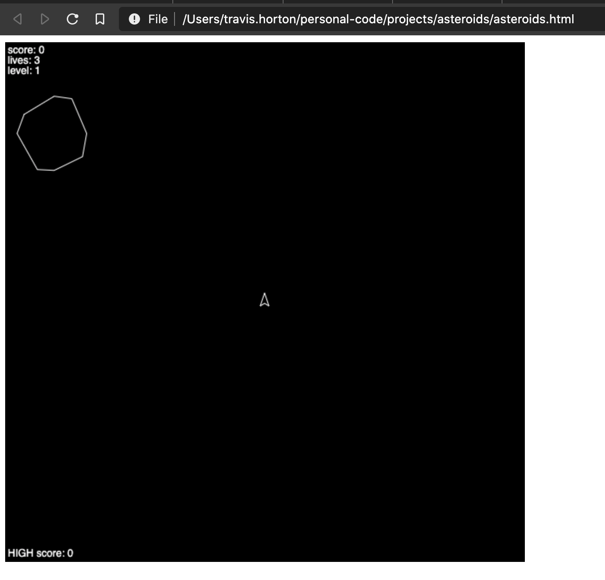

# asteroids

this is a personal project in which i emulate the original 1979 <a href='https://en.wikipedia.org/wiki/Asteroids_(video_game)'>asteroids</a> on atari. i'm not trying to get it exactly the same, just close.

## getting started

here's how you run this guy:

### prerequisites

NONE

### installing

simply
```
git clone [this repo name]
```
and open asteroids.html in a browser and you should see something like:


## running tests

right now there aren't any tests. we'll be fixing that with this pr

we might even have a linter!

## deployment

right now there isn't a deployment process. i just upload it to my digital ocean droplet. (actually it's even worse than that, i copy the file into my www repo and then upload that to the digital ocean droplet.) again, something we'll fix with this pr.

## built with

vanilla javascript. not even a single basic npm repo.

## contributing

not much to say. if you want to clone the repo, go for it. if you have comments on the code, i'd love to hear them!

## versioning

i'm gonna institute semver from here on, so right now there will only be a 1.0.0

## authors

- **kiddspazz** www.travish.com

## license

completely free

## acknowledgements

the inspiration for this project came from [david albert](https://github.com/davidbalbert). thanks dave!
